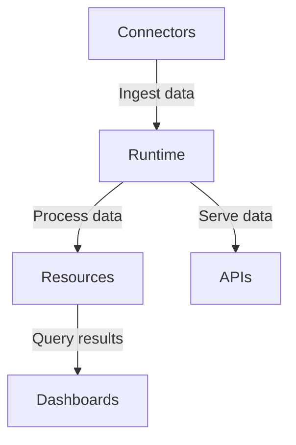

# Rill Concepts

Rill is a powerful data analysis and visualization platform that combines real-time data processing with interactive dashboards. This document explains the core concepts of Rill, including instances, connectors, resources, and the runtime, providing examples of how these concepts are used in practice and how they relate to data analysis and visualization.

## Instances

An instance in Rill represents a single deployment of the Rill platform. Each instance can be configured to connect to various data sources, process data, and serve dashboards to users. Instances are the top-level organizational unit in Rill and can be thought of as isolated environments for different projects or teams.

Example:
```yaml
instance:
  name: "production-analytics"
  region: "us-west-2"
  scale: "medium"
```

## Connectors

Connectors are the bridge between Rill and external data sources. They allow Rill to ingest data from various systems, such as databases, message queues, or APIs. Connectors are responsible for translating the external data format into a format that Rill can process efficiently.

Types of connectors include:
- Database connectors (e.g., MySQL, PostgreSQL, BigQuery)
- Streaming connectors (e.g., Kafka, RabbitMQ)
- File-based connectors (e.g., CSV, JSON, Parquet)

Example of configuring a connector:
```yaml
connectors:
  - name: "sales_db"
    type: "postgresql"
    host: "db.example.com"
    port: 5432
    database: "sales"
    username: "rill_user"
    password: "secret"
```

## Resources

Resources in Rill are the building blocks of data processing and analysis. They represent different types of data assets and processing units within the Rill ecosystem. Common types of resources include:

1. Sources: Define the input data streams or tables.
2. Views: Represent transformed or aggregated data.
3. Metrics: Calculate specific business or analytical measures.
4. Dashboards: Visualize data and metrics for end-users.

Example of defining a resource:
```yaml
resources:
  - name: "daily_sales"
    type: "view"
    query: |
      SELECT
        DATE(timestamp) AS date,
        SUM(amount) AS total_sales
      FROM sales_transactions
      GROUP BY 1
```

## Runtime

The Rill runtime is the core engine that powers data processing and query execution. It's responsible for:

1. Managing data ingestion from connectors
2. Executing queries and transformations on the data
3. Maintaining in-memory state for real-time processing
4. Serving query results to dashboards and APIs

The runtime is designed to handle high-throughput, low-latency data processing, enabling real-time analytics and visualization.

Example of how the runtime interacts with other components:


## Putting It All Together

In practice, these concepts work together to create a powerful data analysis and visualization pipeline:

1. Connectors ingest data from various sources into the Rill instance.
2. The runtime processes the incoming data and maintains it in memory for fast access.
3. Resources define how the data should be transformed, aggregated, and presented.
4. Dashboards and APIs query the resources through the runtime to provide real-time insights to users.

This architecture allows Rill to handle large volumes of data with low latency, making it ideal for real-time analytics and interactive data exploration.

By understanding these core concepts, developers can effectively leverage Rill's capabilities to build robust data analysis and visualization solutions for their organizations.